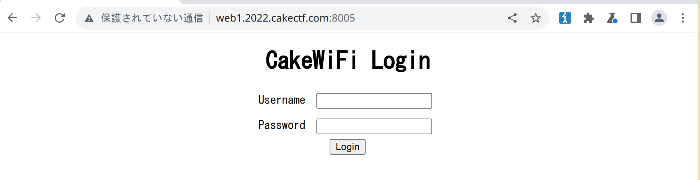
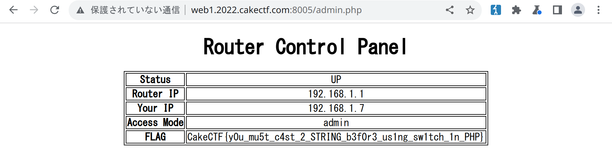

# CakeGEAR

web php

## Analysis

We get a PHP application with a login page and its source.

When we try to log in it POSTs JSON to `index.php`. Here's the part of
the code that handles that.

    <?php
    session_start();
    $_SESSION = array();
    define('ADMIN_PASSWORD', 'f365691b6e7d8bc4e043ff1b75dc660708c1040e');

    /* Router login API */
    $req = @json_decode(file_get_contents("php://input"));
    if (isset($req->username) && isset($req->password)) {
        if ($req->username === 'godmode'
            && !in_array($_SERVER['REMOTE_ADDR'], ['127.0.0.1', '::1'])) {
            /* Debug mode is not allowed from outside the router */
            $req->username = 'nobody';
        }

        switch ($req->username) {
            case 'godmode':
                /* No password is required in god mode */
                $_SESSION['login'] = true;
                $_SESSION['admin'] = true;
                break;

            case 'admin':
                /* Secret password is required in admin mode */
                if (sha1($req->password) === ADMIN_PASSWORD) {
                    $_SESSION['login'] = true;
                    $_SESSION['admin'] = true;
                }
                break;

            case 'guest':
                /* Guest mode (low privilege) */
                if ($req->password === 'guest') {
                    $_SESSION['login'] = true;
                    $_SESSION['admin'] = false;
                }
                break;
        }

        /* Return response */
        if (isset($_SESSION['login']) && $_SESSION['login'] === true) {
            echo json_encode(array('status'=>'success'));
            exit;
        } else {
            echo json_encode(array('status'=>'error'));
            exit;
        }
    }

We can login as `godmode`, `admin` or `guest`. Only `godmode` and
`admin` set `$_SESSION['admin']` to `true`, which is what we need to
access the flag.

`godmode` requires us to make the request from `localhost` and `admin`
requires us to break a `sha1` hash. We tried to break the hash, but
couldn't. The password is probably something hard to guess.

## Solution

It's important to notice that when we log in we POST our credentials as
JSON. This means that we can use any of the types JSON supports, like a
`boolean`.

If we set `username` to `true`, this check will fail because the `===`
operator makes sure both operands have the same type (in this case one
is a `boolean` and the other is a `string`).

    if ($req->username === 'godmode'
    <snip>
    }

The `switch` clause uses the `==` operator however. `"string" == true`
actually evaluates to `true`, because PHP. This means that we fall into
the first `case` and get logged in as `godmode`.

Here's the payload.

    {"username":true,"password":"abc"}

With that, we get the flag:
`CakeCTF{y0u_mu5t_c4st_2_STRING_b3f0r3_us1ng_sw1tch_1n_PHP}`.

