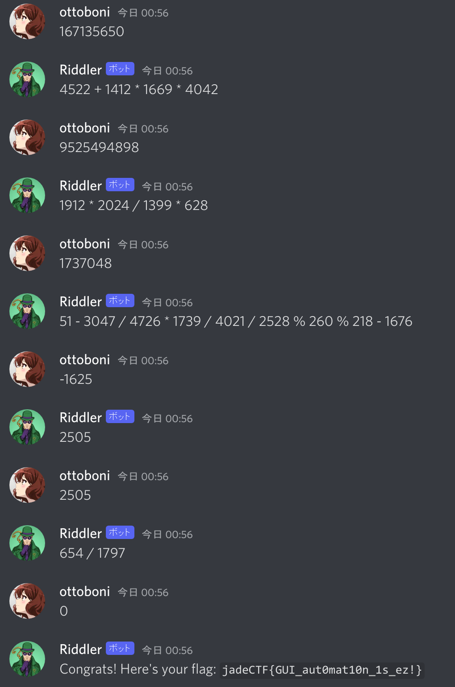

# Riddle me this

## Challenge

Discord bots are awesome! Some can answer any question you ask, while
some ask you questions.

- Use channel \#botspam. Tag the bot @Riddler and he will dm you ;)
- Be fast with your answers, the bot doesn't entertain those who are
  slow :V
- Division is integer division

## Solution

After tagging the bot, we get the following message.

    Hello, @ottoboni. Your QUEST-ions begin now! Answer these 200 questions to get a reward!

The questions look something like this.

    1367 * 4740 % 2448 * 873 % 1826 + 3537 / 4411 + 4580 - 2522 / 2351

At first I made a self-bot using
[discord.py-self](https://github.com/dolfies/discord.py-self). It kind
of worked, but for some reason it would randomly take too long to
respond. If you take longer than around 2 seconds to answer the riddler,
he just ignores you. This bot could take me to around 100 answers before
invariably taking too long.

    #!/usr/bin/env python3

    import discord
    import re
    from time import sleep

    TOKEN = "<REDACTED>"

    class MyClient(discord.Client):

        async def on_ready(self):
            print('Logged on as', self.user)

        async def on_message(self, message):
            if message.author.name != "Riddler" or message.author.discriminator != "6118":
                return

            msg = message.content

            if not re.match(r"^[\d\s+*%/-]+$", msg):
                return

            # sleep(1.5)

            msg = msg.replace("/", "//")
            await message.channel.send(eval(msg))

    client = MyClient(sync_presence=False)
    client.run(TOKEN)

I wasted a lot of time trying to fix this, but nothing really worked.

The solution that actually got me the flag is really janky: I made a
reduced version of the script that simply gets the riddle via argv and
prints out the answer. I then made a keybind using
[sxhkd](https://github.com/baskerville/sxhkd) that runs my clipboard
through the script and puts the answer back in the clipboard. For each
riddle, I selected the text, used the keybind, and then pasted it back.
This method was fast enough for the riddler, so I did it for all 200
questions.

The reduced version of the script:

    #!/usr/bin/env python3
    # go.py

    import sys

    msg = sys.argv[1]
    msg = msg.replace("/", "//")
    print(eval(msg))

The keybind:

    super + a
        /home/gabriel/ctf/jade/misc/riddle/go.py "$(xclip -out)" | xclip -in

Flag: `jadeCTF{GUI_aut0mat10n_1s_ez!}`
