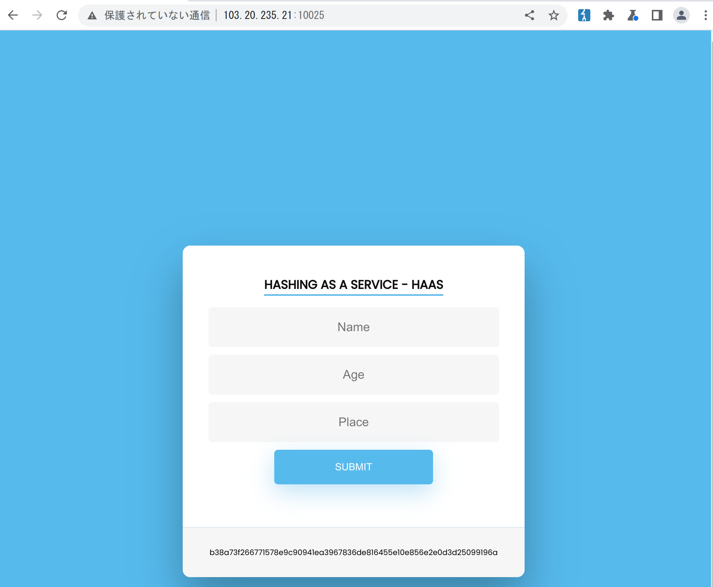
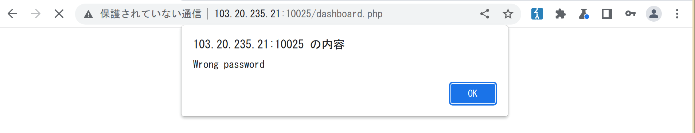
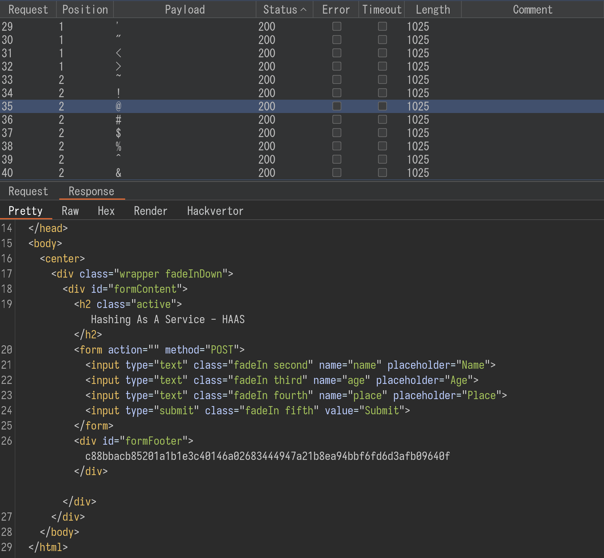
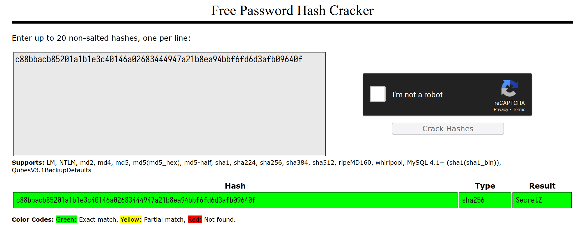
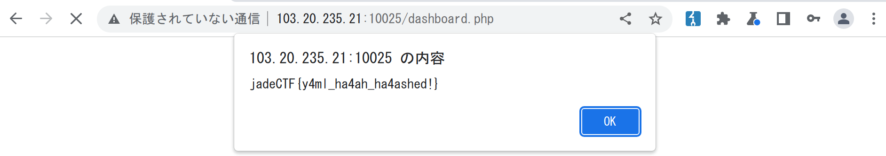

# HAAS

## Challenge

Hashing as a service: Yet another "as-a-service" challenge **Note**: Enumeration is allowed, but don't use large
wordlists.

<http://103.20.235.21:10025/>

## Solution

After visiting the link we get to a page with three fields. I wrote
something random in them and hit submit, which gave me what seems to be
a hash.

I tried to crack the hash with crackstation, but it was unknown. Besides
the form, there's nothing interesting in the page, so I decided to do
some enumeration. It's important to note that the home page is actually
`index.php`, so I looked for pages with the `.php` extension.

    301      GET        9l       28w      324c http://103.20.235.21:10025/assets => http://103.20.235.21:10025/assets/
    301      GET        9l       28w      325c http://103.20.235.21:10025/sandbox => http://103.20.235.21:10025/sandbox/
    200      GET       15l       24w      289c http://103.20.235.21:10025/dashboard.php
    200      GET        0l        0w        0c http://103.20.235.21:10025/secret.php
    403      GET        9l       28w      281c http://103.20.235.21:10025/server-status

I tried to enumerate `/assets` and `/sandbox`, but didn't really find
anything. `secret.php` returns a completely empty page, it probably just
has some PHP code. `dashboard.php` is completely blank when viewed in a
browser, but actually has a form in it.

    
    <form action="" method="POST">  
        <!-- Secret: --><input type="password" name="secret"/>
        <!-- <input type="submit"/>   -->
    </form>

I tried to guess and fuzz the password, but didn't get anywhere.

Having nothing else to do, I decided to fuzz the fields in the home page
with special chars. All responses I got had the same length, but for
some reason while scrolling I noticed that, while the hashes seemed
completely random sometimes, there was a specific hash that showed up
multiple times in the responses:
`c88bbacb85201a1b1e3c40146a02683444947a21b8ea94bbf6fd6d3afb09640f`.

This was the only hash that showed up multiple times, so I figured maybe
there was something special to it or something and ran it through
crackstation.

Huh, this one actually gave me a password back. Maybe it's the secret
for `dashboard.php`?

Wait, what? This worked? Yaml? What yaml? Something tells me this was
not the intended solution.

Flag: `jadeCTF{y4ml_ha4ah_ha4ashed!}`
